Praktikum 1: Membuat Project Flutter Baru
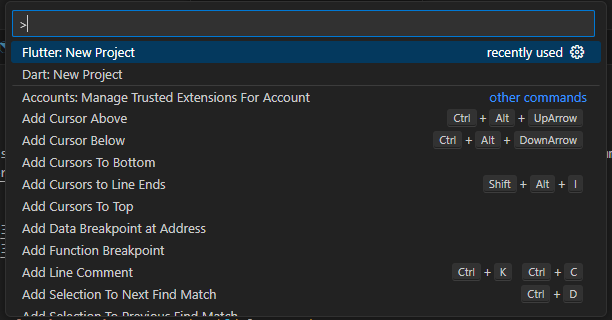
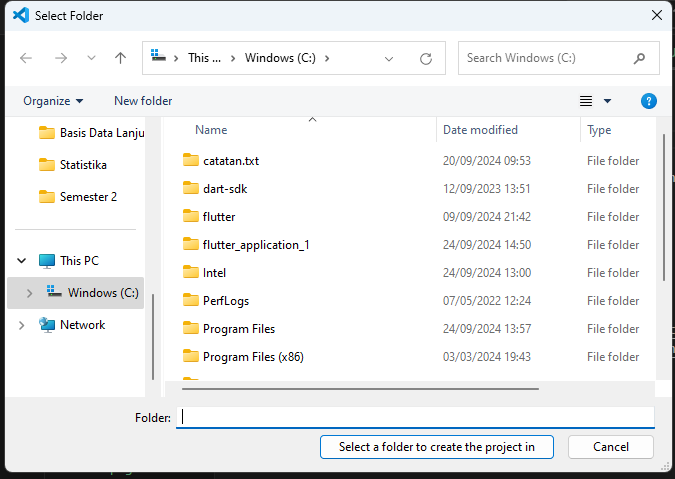
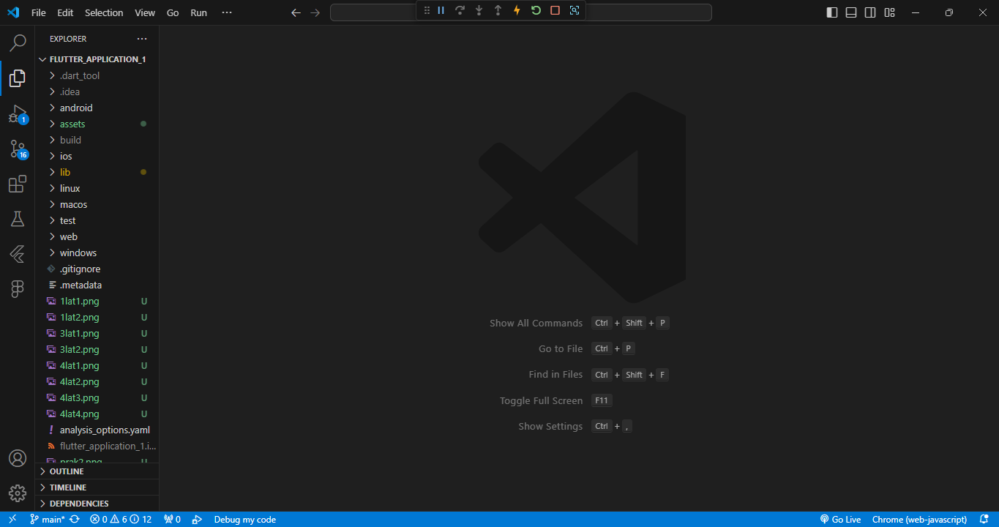

Praktikum 2: Membuat Repository GitHub dan Laporan Praktikum
Melakukan push juga untuk semua file lainnya dengan pilih Stage All Changes. Beri pesan commit "project hello_world"
Hasil:
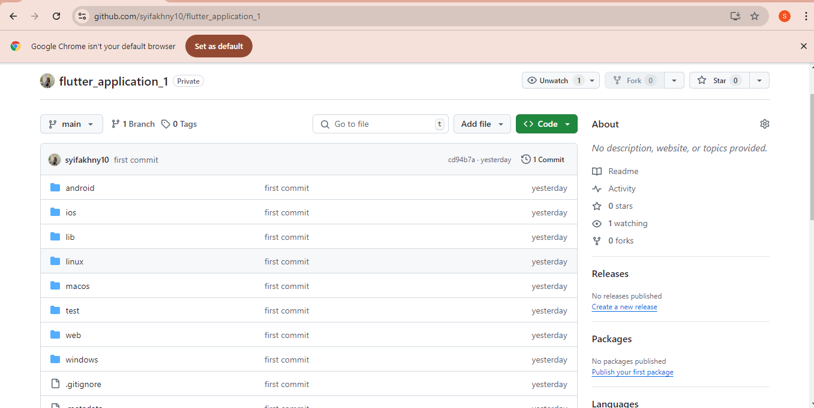

Praktikum 3: Menerapkan Widget Dasar
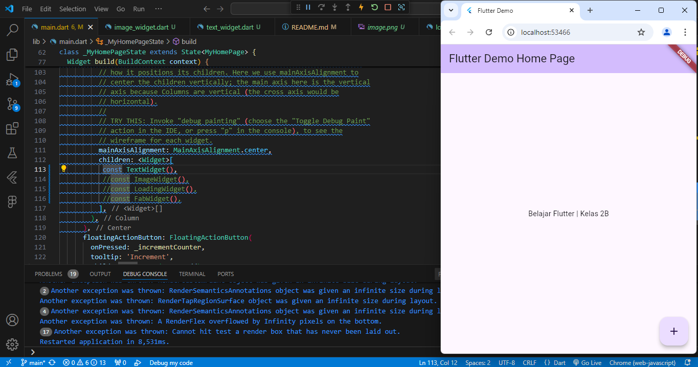
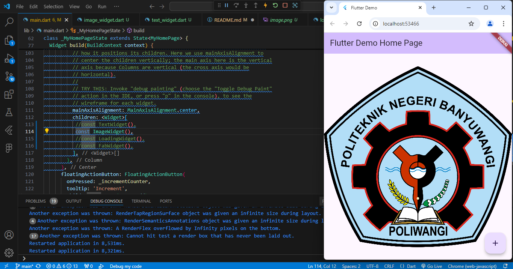

Praktikum 4: Menerapkan Widget Material Design dan iOS Cupertino
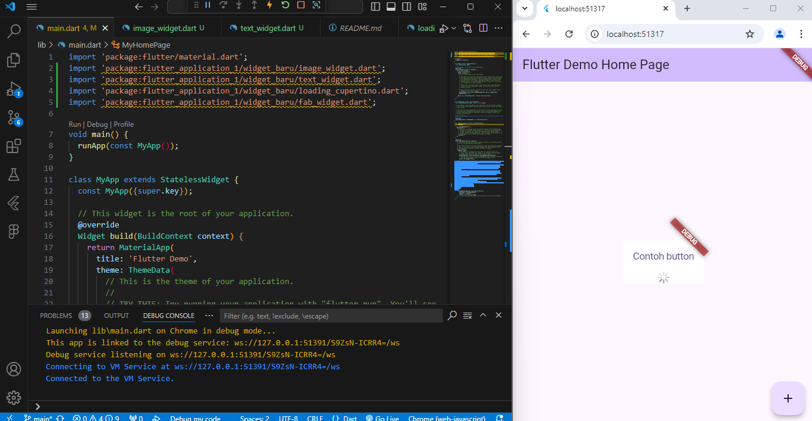
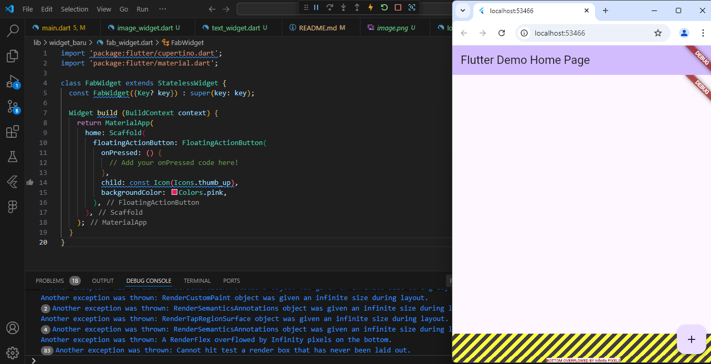
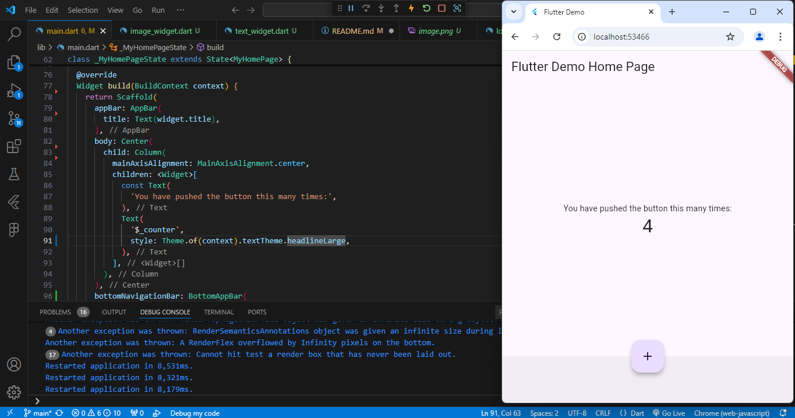
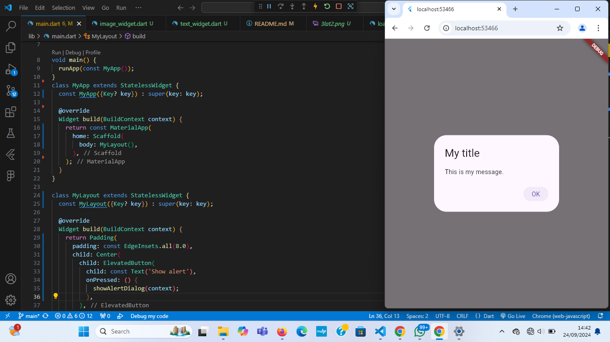
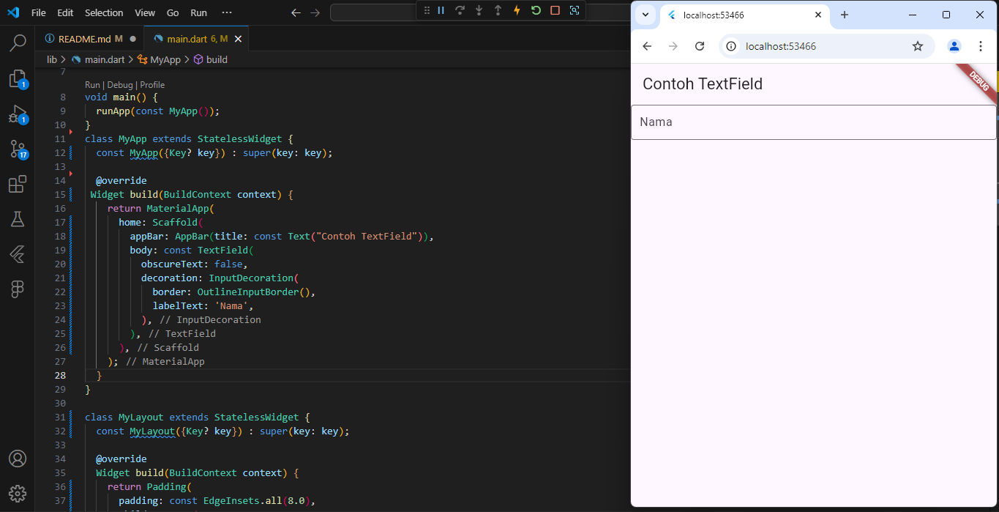
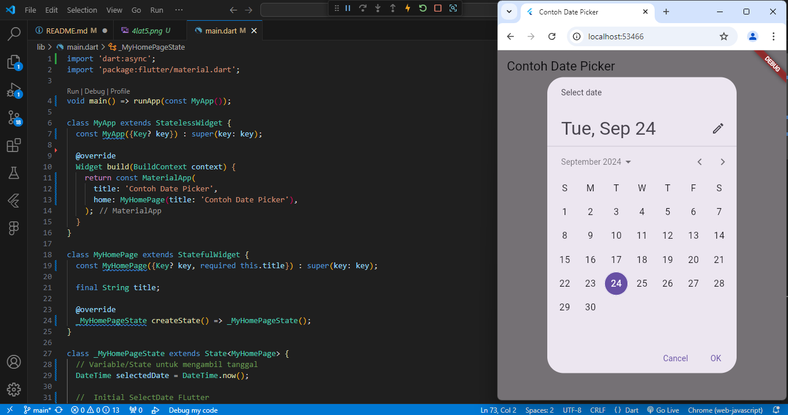
